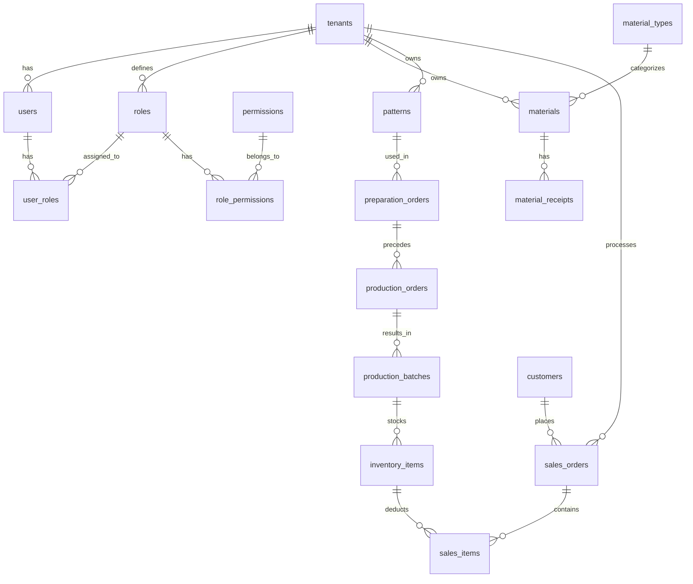

# Database Schema - Fabriku

## Overview
Database schema untuk Fabriku menggunakan PostgreSQL dengan multi-tenancy architecture. Setiap tenant memiliki data yang terisolasi dengan tenant_id.

**Design Philosophy**: Schema dirancang **category-agnostic** (tidak spesifik garment saja) untuk mendukung berbagai jenis bisnis UMKM. Terminologi menggunakan istilah generik yang bisa diaplikasikan untuk garment, makanan/kue, craft, dll.

**Supported Categories** (MVP):
1. **Garment** - Pattern, Cutting (Preparation), Sewing (Production)
2. **Food/Kue** - Recipe, Mixing/Prep (Preparation), Baking/Cooking (Production)
3. **Craft** - Template, Assembly Prep (Preparation), Assembly (Production)
4. **Cosmetic** - Formula, Formulation (Preparation), Production

**Simplified Approach**: No Bill of Materials (BOM), no presisi tracking - cocok untuk UMKM yang masih manual.

## Entity Relationship Diagram (ERD)



## Table Definitions

### 1. System & Multi-tenancy

#### tenants
Informasi organisasi/tenant dalam sistem SaaS.

```sql
CREATE TABLE tenants (
    id BIGSERIAL PRIMARY KEY,
    name VARCHAR(255) NOT NULL,
    slug VARCHAR(255) UNIQUE NOT NULL,
    email VARCHAR(255),
    phone VARCHAR(50),
    address TEXT,
    logo_url VARCHAR(500),
    is_active BOOLEAN DEFAULT TRUE,
    subscription_plan VARCHAR(50) DEFAULT 'trial',
    subscription_expires_at TIMESTAMP,
    settings JSONB DEFAULT '{}',
    created_at TIMESTAMP DEFAULT CURRENT_TIMESTAMP,
    updated_at TIMESTAMP DEFAULT CURRENT_TIMESTAMP
);
```

#### system_settings
System-wide or tenant-specific settings.

```sql
CREATE TABLE system_settings (
    id BIGSERIAL PRIMARY KEY,
    tenant_id BIGINT REFERENCES tenants(id) ON DELETE CASCADE, -- Nullable for global settings
    key VARCHAR(100) NOT NULL,
    value TEXT,
    type VARCHAR(20) DEFAULT 'string', -- string, number, boolean, json
    description TEXT,
    is_public BOOLEAN DEFAULT FALSE,
    created_at TIMESTAMP DEFAULT CURRENT_TIMESTAMP,
    updated_at TIMESTAMP DEFAULT CURRENT_TIMESTAMP,
    CONSTRAINT system_settings_tenant_key_unique UNIQUE (tenant_id, key)
);
```

#### subscription_payments
Records of subscription payments.

```sql
CREATE TABLE subscription_payments (
    id BIGSERIAL PRIMARY KEY,
    tenant_id BIGINT NOT NULL REFERENCES tenants(id) ON DELETE CASCADE,
    amount DECIMAL(15, 2) NOT NULL,
    proof_path VARCHAR(255) NOT NULL,
    status VARCHAR(50) DEFAULT 'pending', -- pending, approved, rejected
    admin_id BIGINT REFERENCES admin_users(id) ON DELETE SET NULL,
    rejection_reason TEXT,
    plan_type VARCHAR(50) DEFAULT 'monthly',
    duration_months INTEGER DEFAULT 1,
    created_at TIMESTAMP DEFAULT CURRENT_TIMESTAMP,
    updated_at TIMESTAMP DEFAULT CURRENT_TIMESTAMP
);
```

### 2. Authentication & RBAC

#### admin_users
Super administrators for the SaaS platform.

```sql
CREATE TABLE admin_users (
    id BIGSERIAL PRIMARY KEY,
    name VARCHAR(255) NOT NULL,
    email VARCHAR(255) UNIQUE NOT NULL,
    password VARCHAR(255) NOT NULL,
    role VARCHAR(50) DEFAULT 'admin',
    phone VARCHAR(50),
    is_active BOOLEAN DEFAULT TRUE,
    last_login_at TIMESTAMP,
    remember_token VARCHAR(100),
    created_at TIMESTAMP DEFAULT CURRENT_TIMESTAMP,
    updated_at TIMESTAMP DEFAULT CURRENT_TIMESTAMP
);
```

#### users
Tenant users.

```sql
CREATE TABLE users (
    id BIGSERIAL PRIMARY KEY,
    tenant_id BIGINT NOT NULL REFERENCES tenants(id) ON DELETE CASCADE,
    name VARCHAR(255) NOT NULL,
    email VARCHAR(255) NOT NULL,
    email_verified_at TIMESTAMP,
    password VARCHAR(255) NOT NULL,
    role VARCHAR(50) DEFAULT 'staff',
    phone VARCHAR(50),
    is_active BOOLEAN DEFAULT TRUE,
    avatar_url VARCHAR(500),
    last_login_at TIMESTAMP,
    created_at TIMESTAMP DEFAULT CURRENT_TIMESTAMP,
    updated_at TIMESTAMP DEFAULT CURRENT_TIMESTAMP,
    CONSTRAINT users_tenant_email_unique UNIQUE (tenant_id, email)
);
```

#### roles
Roles defined for tenants.

```sql
CREATE TABLE roles (
    id BIGSERIAL PRIMARY KEY,
    tenant_id BIGINT REFERENCES tenants(id) ON DELETE CASCADE, -- Nullable for system roles
    name VARCHAR(100) NOT NULL,
    slug VARCHAR(100) NOT NULL,
    description TEXT,
    is_system_role BOOLEAN DEFAULT FALSE,
    created_at TIMESTAMP DEFAULT CURRENT_TIMESTAMP,
    updated_at TIMESTAMP DEFAULT CURRENT_TIMESTAMP,
    CONSTRAINT roles_tenant_slug_unique UNIQUE (tenant_id, slug)
);
```

#### permissions
Available system permissions.

```sql
CREATE TABLE permissions (
    id BIGSERIAL PRIMARY KEY,
    name VARCHAR(100) NOT NULL,
    slug VARCHAR(100) UNIQUE NOT NULL,
    module VARCHAR(50),
    description TEXT,
    created_at TIMESTAMP DEFAULT CURRENT_TIMESTAMP,
    updated_at TIMESTAMP DEFAULT CURRENT_TIMESTAMP
);
```

#### role_permissions
Mapping between roles and permissions.

```sql
CREATE TABLE role_permissions (
    id BIGSERIAL PRIMARY KEY,
    role_id BIGINT NOT NULL REFERENCES roles(id) ON DELETE CASCADE,
    permission_id BIGINT NOT NULL REFERENCES permissions(id) ON DELETE CASCADE,
    created_at TIMESTAMP DEFAULT CURRENT_TIMESTAMP,
    updated_at TIMESTAMP DEFAULT CURRENT_TIMESTAMP,
    CONSTRAINT role_permissions_unique UNIQUE (role_id, permission_id)
);
```

#### user_roles
Mapping between users and roles.

```sql
CREATE TABLE user_roles (
    id BIGSERIAL PRIMARY KEY,
    user_id BIGINT NOT NULL REFERENCES users(id) ON DELETE CASCADE,
    role_id BIGINT NOT NULL REFERENCES roles(id) ON DELETE CASCADE,
    created_at TIMESTAMP DEFAULT CURRENT_TIMESTAMP,
    updated_at TIMESTAMP DEFAULT CURRENT_TIMESTAMP,
    CONSTRAINT user_roles_unique UNIQUE (user_id, role_id)
);
```

### 3. Materials Management

#### material_types
Categories for materials.

```sql
CREATE TABLE material_types (
    id BIGSERIAL PRIMARY KEY,
    tenant_id BIGINT NOT NULL REFERENCES tenants(id) ON DELETE CASCADE,
    name VARCHAR(255) NOT NULL,
    code VARCHAR(50) NOT NULL,
    unit VARCHAR(50) NOT NULL,
    description TEXT,
    sort_order INTEGER DEFAULT 0,
    is_active BOOLEAN DEFAULT TRUE,
    created_at TIMESTAMP DEFAULT CURRENT_TIMESTAMP,
    updated_at TIMESTAMP DEFAULT CURRENT_TIMESTAMP,
    CONSTRAINT material_types_code_unique UNIQUE (code) -- Global or tenant scoped based on implementation
);
```

#### materials
Raw materials / ingredients.

```sql
CREATE TABLE materials (
    id BIGSERIAL PRIMARY KEY,
    tenant_id BIGINT NOT NULL REFERENCES tenants(id) ON DELETE CASCADE,
    material_type_id BIGINT NOT NULL REFERENCES material_types(id) ON DELETE CASCADE,
    code VARCHAR(50) NOT NULL,
    name VARCHAR(255) NOT NULL,
    supplier_name VARCHAR(255),
    price_per_unit DECIMAL(15, 2) DEFAULT 0,
    stock_quantity DECIMAL(15, 3) DEFAULT 0,
    min_stock DECIMAL(15, 3) DEFAULT 0,
    reorder_point DECIMAL(15, 3),
    unit VARCHAR(50) NOT NULL,
    image_path VARCHAR(255),
    description TEXT,
    created_at TIMESTAMP DEFAULT CURRENT_TIMESTAMP,
    updated_at TIMESTAMP DEFAULT CURRENT_TIMESTAMP,
    deleted_at TIMESTAMP,
    CONSTRAINT materials_tenant_code_unique UNIQUE (tenant_id, code)
);
```

#### material_receipts
Stock-in records for materials.

```sql
CREATE TABLE material_receipts (
    id BIGSERIAL PRIMARY KEY,
    tenant_id BIGINT NOT NULL REFERENCES tenants(id) ON DELETE CASCADE,
    material_id BIGINT NOT NULL REFERENCES materials(id) ON DELETE CASCADE,
    receipt_number VARCHAR(50) NOT NULL,
    supplier_name VARCHAR(255) NOT NULL,
    quantity DECIMAL(15, 3) NOT NULL,
    unit VARCHAR(50) NOT NULL,
    price_per_unit DECIMAL(15, 2) NOT NULL,
    total_cost DECIMAL(15, 2) NOT NULL,
    receipt_date DATE NOT NULL,
    batch_number VARCHAR(100),
    image_path VARCHAR(255),
    expired_date DATE,
    received_by BIGINT REFERENCES users(id) ON DELETE SET NULL,
    notes TEXT,
    created_at TIMESTAMP DEFAULT CURRENT_TIMESTAMP,
    updated_at TIMESTAMP DEFAULT CURRENT_TIMESTAMP,
    CONSTRAINT material_receipts_number_unique UNIQUE (receipt_number)
);
```

#### material_attributes
Dynamic attributes for materials.

```sql
CREATE TABLE material_attributes (
    id BIGSERIAL PRIMARY KEY,
    material_id BIGINT NOT NULL REFERENCES materials(id) ON DELETE CASCADE,
    attribute_key VARCHAR(100) NOT NULL,
    attribute_value VARCHAR(255) NOT NULL,
    created_at TIMESTAMP DEFAULT CURRENT_TIMESTAMP,
    updated_at TIMESTAMP DEFAULT CURRENT_TIMESTAMP
);
```

### 4. Production (Core)

#### patterns
Product templates.

```sql
CREATE TABLE patterns (
    id BIGSERIAL PRIMARY KEY,
    tenant_id BIGINT NOT NULL REFERENCES tenants(id) ON DELETE CASCADE,
    code VARCHAR(50) NOT NULL,
    name VARCHAR(255) NOT NULL,
    category VARCHAR(50) DEFAULT 'other',
    product_type VARCHAR(100) NOT NULL,
    size VARCHAR(50),
    description TEXT,
    image_url VARCHAR(500),
    is_active BOOLEAN DEFAULT TRUE,
    created_at TIMESTAMP DEFAULT CURRENT_TIMESTAMP,
    updated_at TIMESTAMP DEFAULT CURRENT_TIMESTAMP,
    CONSTRAINT patterns_tenant_code_unique UNIQUE (tenant_id, code)
);
```

#### preparation_orders
Pre-production steps (Cutting/Mixing/Prep).

```sql
CREATE TABLE preparation_orders (
    id BIGSERIAL PRIMARY KEY,
    tenant_id BIGINT NOT NULL REFERENCES tenants(id) ON DELETE CASCADE,
    order_number VARCHAR(50) NOT NULL,
    pattern_id BIGINT REFERENCES patterns(id) ON DELETE RESTRICT,
    order_date DATE NOT NULL,
    status VARCHAR(50) DEFAULT 'draft',
    prepared_by BIGINT REFERENCES users(id),
    output_quantity DECIMAL(10,2) NOT NULL,
    output_unit VARCHAR(20) DEFAULT 'pieces',
    materials_used JSONB NOT NULL,
    notes TEXT,
    started_at TIMESTAMP,
    completed_at TIMESTAMP,
    created_at TIMESTAMP DEFAULT CURRENT_TIMESTAMP,
    updated_at TIMESTAMP DEFAULT CURRENT_TIMESTAMP,
    CONSTRAINT preparation_orders_tenant_number_unique UNIQUE (tenant_id, order_number)
);
```

#### contractors
External production partners.

```sql
CREATE TABLE contractors (
    id BIGSERIAL PRIMARY KEY,
    tenant_id BIGINT NOT NULL REFERENCES tenants(id) ON DELETE CASCADE,
    code VARCHAR(50) NOT NULL,
    name VARCHAR(255) NOT NULL,
    type VARCHAR(50),
    contact_person VARCHAR(255),
    phone VARCHAR(50),
    address TEXT,
    price_per_unit DECIMAL(15,2),
    rating DECIMAL(3,2),
    is_active BOOLEAN DEFAULT TRUE,
    notes TEXT,
    created_at TIMESTAMP DEFAULT CURRENT_TIMESTAMP,
    updated_at TIMESTAMP DEFAULT CURRENT_TIMESTAMP,
    CONSTRAINT contractors_tenant_code_unique UNIQUE (tenant_id, code)
);
```

#### production_orders
Production orders (Internal/External).

```sql
CREATE TABLE production_orders (
    id BIGSERIAL PRIMARY KEY,
    tenant_id BIGINT NOT NULL REFERENCES tenants(id) ON DELETE CASCADE,
    order_number VARCHAR(50) NOT NULL,
    preparation_order_id BIGINT REFERENCES preparation_orders(id) ON DELETE RESTRICT,
    production_type VARCHAR(50) NOT NULL,
    contractor_id BIGINT REFERENCES contractors(id) ON DELETE RESTRICT,
    order_date DATE NOT NULL,
    quantity_target DECIMAL(10,2) NOT NULL,
    quantity_unit VARCHAR(20) DEFAULT 'pieces',
    quantity_completed DECIMAL(10,2) DEFAULT 0,
    cost_per_unit DECIMAL(15,2),
    total_cost DECIMAL(15,2),
    status VARCHAR(50) DEFAULT 'draft',
    sent_at TIMESTAMP,
    expected_return_date DATE,
    notes TEXT,
    created_at TIMESTAMP DEFAULT CURRENT_TIMESTAMP,
    updated_at TIMESTAMP DEFAULT CURRENT_TIMESTAMP,
    CONSTRAINT production_orders_tenant_number_unique UNIQUE (tenant_id, order_number)
);
```

#### production_batches
Production results.

```sql
CREATE TABLE production_batches (
    id BIGSERIAL PRIMARY KEY,
    tenant_id BIGINT NOT NULL REFERENCES tenants(id) ON DELETE CASCADE,
    batch_number VARCHAR(50) NOT NULL,
    production_order_id BIGINT NOT NULL REFERENCES production_orders(id) ON DELETE CASCADE,
    return_date DATE NOT NULL,
    pieces_received INTEGER NOT NULL,
    pieces_good INTEGER NOT NULL,
    pieces_defect INTEGER DEFAULT 0,
    quality_grade VARCHAR(20),
    qc_notes TEXT,
    qc_by BIGINT REFERENCES users(id),
    created_at TIMESTAMP DEFAULT CURRENT_TIMESTAMP,
    updated_at TIMESTAMP DEFAULT CURRENT_TIMESTAMP,
    CONSTRAINT production_batches_tenant_number_unique UNIQUE (tenant_id, batch_number)
);
```

### 5. Inventory & Sales

#### inventory_locations
Warehouse storage locations.

```sql
CREATE TABLE inventory_locations (
    id BIGSERIAL PRIMARY KEY,
    tenant_id BIGINT NOT NULL REFERENCES tenants(id) ON DELETE CASCADE,
    code VARCHAR(50) NOT NULL,
    name VARCHAR(255) NOT NULL,
    type VARCHAR(50) DEFAULT 'rack',
    capacity INTEGER,
    is_active BOOLEAN DEFAULT TRUE,
    created_at TIMESTAMP DEFAULT CURRENT_TIMESTAMP,
    updated_at TIMESTAMP DEFAULT CURRENT_TIMESTAMP,
    CONSTRAINT inventory_locations_tenant_code_unique UNIQUE (tenant_id, code)
);
```

#### inventory_items
Finished goods stock.

```sql
CREATE TABLE inventory_items (
    id BIGSERIAL PRIMARY KEY,
    tenant_id BIGINT NOT NULL REFERENCES tenants(id) ON DELETE CASCADE,
    sku VARCHAR(100) NOT NULL,
    production_batch_id BIGINT REFERENCES production_batches(id) ON DELETE RESTRICT, -- Nullable
    production_order_id BIGINT REFERENCES production_orders(id) ON DELETE RESTRICT, -- Nullable
    pattern_id BIGINT NOT NULL REFERENCES patterns(id) ON DELETE RESTRICT,
    location_id BIGINT REFERENCES inventory_locations(id) ON DELETE SET NULL,
    initial_quantity INTEGER NOT NULL,
    current_quantity INTEGER NOT NULL,
    reserved_quantity INTEGER DEFAULT 0,
    status VARCHAR(50) DEFAULT 'available',
    cost_per_piece DECIMAL(15,2),
    selling_price DECIMAL(15,2),
    image_path VARCHAR(255),
    stored_at TIMESTAMP,
    created_at TIMESTAMP DEFAULT CURRENT_TIMESTAMP,
    updated_at TIMESTAMP DEFAULT CURRENT_TIMESTAMP,
    CONSTRAINT inventory_items_tenant_sku_unique UNIQUE (tenant_id, sku)
);
```

#### customers
Customer data.

```sql
CREATE TABLE customers (
    id BIGSERIAL PRIMARY KEY,
    tenant_id BIGINT NOT NULL REFERENCES tenants(id) ON DELETE CASCADE,
    code VARCHAR(50) NOT NULL,
    name VARCHAR(255) NOT NULL,
    type VARCHAR(50) DEFAULT 'retail',
    email VARCHAR(255),
    phone VARCHAR(50),
    address TEXT,
    city VARCHAR(100),
    province VARCHAR(100),
    postal_code VARCHAR(20),
    tax_id VARCHAR(50),
    is_active BOOLEAN DEFAULT TRUE,
    notes TEXT,
    created_at TIMESTAMP DEFAULT CURRENT_TIMESTAMP,
    updated_at TIMESTAMP DEFAULT CURRENT_TIMESTAMP,
    CONSTRAINT customers_tenant_code_unique UNIQUE (tenant_id, code)
);
```

#### sales_orders
Sales transactions.

```sql
CREATE TABLE sales_orders (
    id BIGSERIAL PRIMARY KEY,
    tenant_id BIGINT NOT NULL REFERENCES tenants(id) ON DELETE CASCADE,
    order_number VARCHAR(50) NOT NULL,
    customer_id BIGINT REFERENCES customers(id) ON DELETE RESTRICT,
    order_date DATE NOT NULL,
    sales_channel VARCHAR(50) DEFAULT 'offline',
    subtotal DECIMAL(15,2) NOT NULL,
    discount DECIMAL(15,2) DEFAULT 0,
    tax DECIMAL(15,2) DEFAULT 0,
    shipping_cost DECIMAL(15,2) DEFAULT 0,
    total_amount DECIMAL(15,2) NOT NULL,
    payment_status VARCHAR(50) DEFAULT 'unpaid',
    paid_amount DECIMAL(15,2) DEFAULT 0,
    payment_method VARCHAR(50),
    status VARCHAR(50) DEFAULT 'pending',
    notes TEXT,
    sold_by BIGINT REFERENCES users(id),
    created_at TIMESTAMP DEFAULT CURRENT_TIMESTAMP,
    updated_at TIMESTAMP DEFAULT CURRENT_TIMESTAMP,
    CONSTRAINT sales_orders_tenant_number_unique UNIQUE (tenant_id, order_number)
);
```

#### sales_items
Items within sales orders.

```sql
CREATE TABLE sales_items (
    id BIGSERIAL PRIMARY KEY,
    tenant_id BIGINT NOT NULL REFERENCES tenants(id) ON DELETE CASCADE,
    sales_order_id BIGINT NOT NULL REFERENCES sales_orders(id) ON DELETE CASCADE,
    inventory_item_id BIGINT NOT NULL REFERENCES inventory_items(id) ON DELETE RESTRICT,
    quantity INTEGER NOT NULL,
    unit_price DECIMAL(15,2) NOT NULL,
    discount DECIMAL(15,2) DEFAULT 0,
    subtotal DECIMAL(15,2) NOT NULL,
    created_at TIMESTAMP DEFAULT CURRENT_TIMESTAMP,
    updated_at TIMESTAMP DEFAULT CURRENT_TIMESTAMP
);
```

#### audit_logs
System audit trail.

```sql
CREATE TABLE audit_logs (
    id BIGSERIAL PRIMARY KEY,
    tenant_id BIGINT NOT NULL REFERENCES tenants(id) ON DELETE CASCADE,
    user_id BIGINT REFERENCES users(id) ON DELETE SET NULL,
    auditable_type VARCHAR(255) NOT NULL,
    auditable_id BIGINT NOT NULL,
    event VARCHAR(50) NOT NULL,
    old_values JSONB,
    new_values JSONB,
    ip_address VARCHAR(45),
    user_agent TEXT,
    created_at TIMESTAMP DEFAULT CURRENT_TIMESTAMP
);
```

## Data Integrity Rules

1. **Tenant Isolation**: Semua query wajib di-scope by `tenant_id` (via Global Scope).
2. **Soft Deletes**: Digunakan pada tabel `materials` dan tabel master data lain yang relevan.
3. **RBAC**: Akses dikontrol via `user_roles` dan `permissions`, bukan kolom `role` di tabel users.
4. **Foreign Keys**: Cascade delete untuk relasi child-parent dalam satu tenant (misal: pattern -> tenant), tetapi Restrict/Set Null untuk referensi transaksional.
